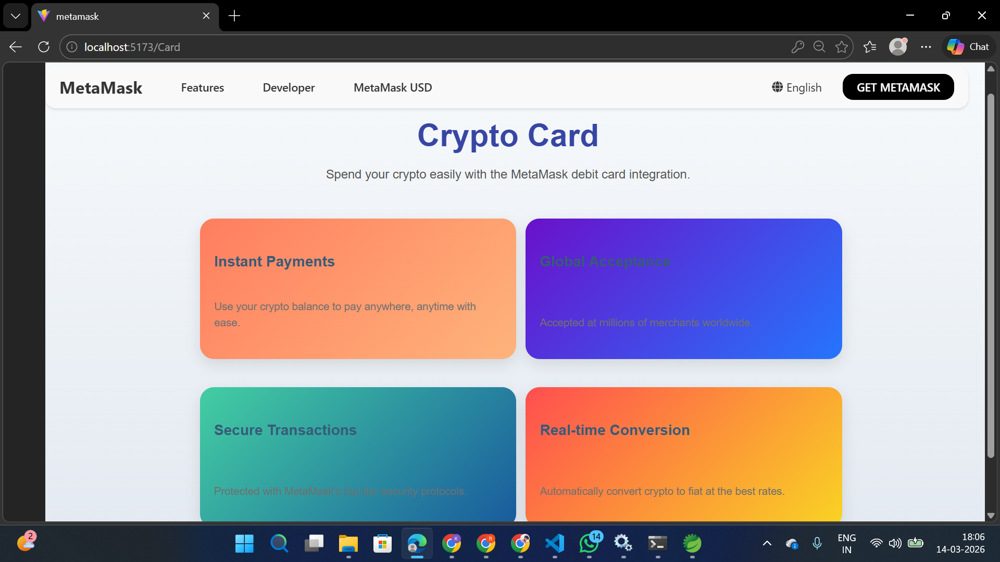
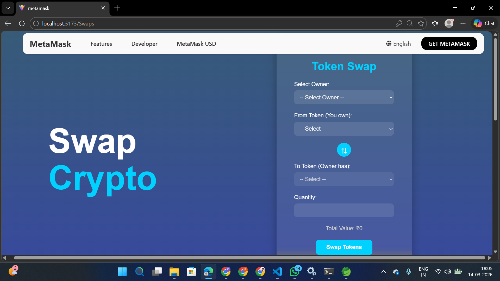
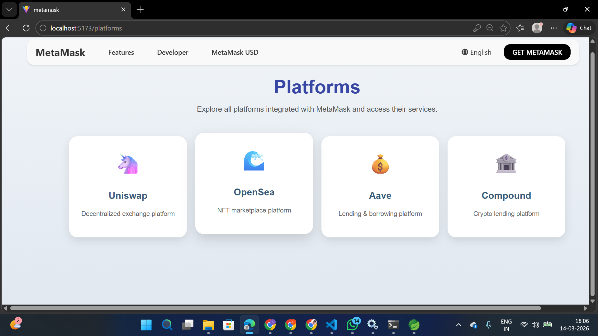
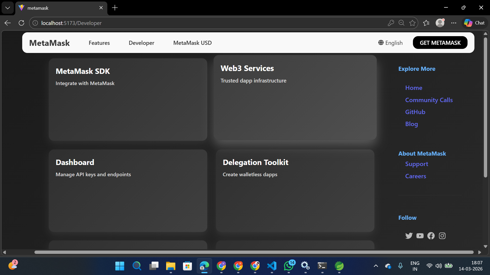

# 🪙 Decentralized Crypto Wallet

A full-stack decentralized cryptocurrency wallet application that allows users to register, manage crypto assets, and perform transactions through a secure backend API.

This project demonstrates integration between a **React frontend**, **Spring Boot backend**, and **Oracle Database**.

---

# 🚀 Features

* User Registration & Login
* Cryptocurrency Dashboard
* Buy & Sell Crypto
* Crypto Swapping
* Real-time crypto data display
* Backend REST APIs
* Secure database storage
* Full-stack architecture

---

# 🧑‍💻 Tech Stack

## Frontend

* React.js
* JavaScript
* HTML5
* CSS3
* Vite

## Backend

* Java
* Spring Boot
* Spring Data JPA
* REST APIs

## Database

* Oracle Database

## Tools

* Git
* GitHub
* Maven
* Spring Tool Suite (STS)
* VS Code

---

# 📂 Project Structure

```
Decentralized-Crypto-Wallet
│
├── README.md
└── Decentralized-Crypto-Wallet-main
      ├── MetaMaskHomepage.png
      ├── MetaMaskSwap.png
      ├── MetaMaskCrypto.png
      ├── MetaMaskBuy&Sell.png
      └── Metamask
            └── Metamask
                  └── src
```

---

# ⚙️ Installation & Setup

## 1️⃣ Clone the Repository

```
git clone https://github.com/kumarBalla/Decentralized-Crypto-Wallet.git
```

---

## 2️⃣ Backend Setup (Spring Boot)

Open the backend project in **Spring Tool Suite**.

Update `application.properties` with your database credentials.

Example:

```
spring.datasource.url=jdbc:oracle:thin:@localhost:1521:XE
spring.datasource.username=Kumar
spring.datasource.password=Kumar123
```

Run the Spring Boot application.

Backend will start on:

```
http://localhost:8081
```

---

## 3️⃣ Frontend Setup (React)

Navigate to the frontend folder.

```
cd Metamask
```

Install dependencies:

```
npm install
```

Run the project:

```
npm run dev
```

Frontend will run on:

```
http://localhost:5173
```

---

# 📸 Project Screenshots

## Homepage


## Crypto Dashboard



## Swap Feature



## Buy & Sell


## Platforms



## Developer Section



---

# 🔐 Future Improvements

* Blockchain integration
* Wallet authentication
* Smart contract support
* Transaction history tracking
* Crypto price API integration

---

# 👨‍💻 Author

**Kumar Balla**

🔗 **GitHub:**
https://github.com/kumarBalla

💼 **LinkedIn:**
https://www.linkedin.com/in/kumar-balla-402b672b4/

🧾 **Naukri:**
https://www.naukri.com/mnjuser/profile?id=&altresid
---

# ⭐ Support

If you like this project, consider giving it a **star ⭐ on GitHub**.
